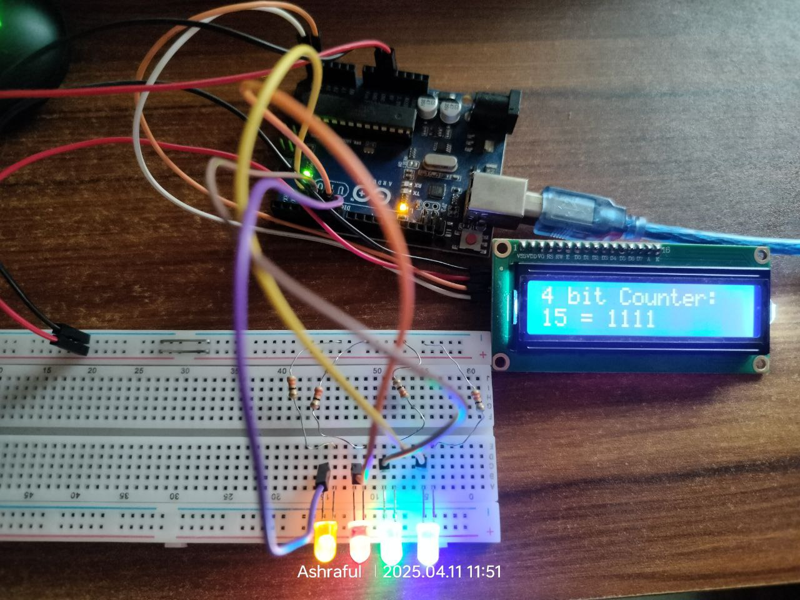
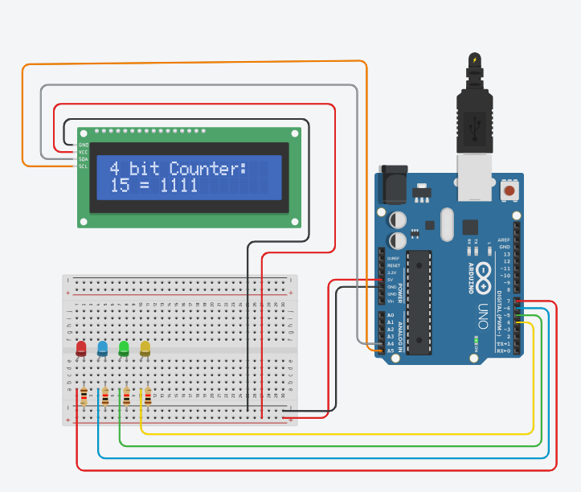
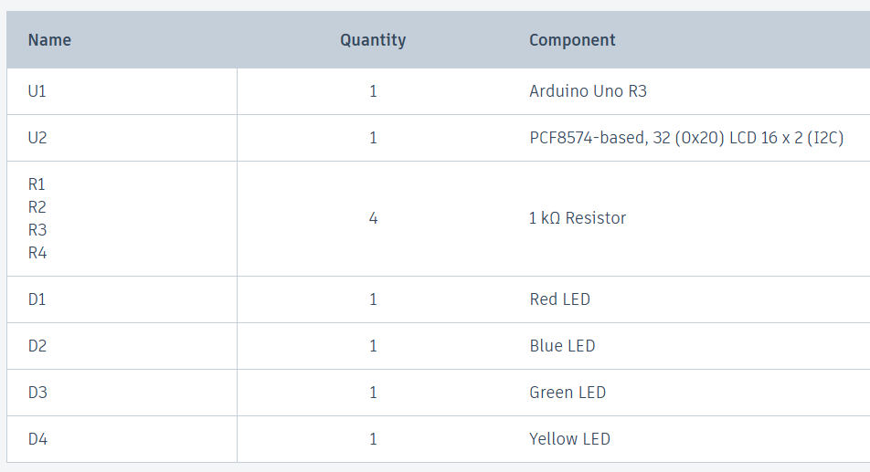

# Project-4: 4 Bit Binary Counter
- ### ***Project Purpose:*** Understand the implementation of Binary numbers using Arduino by making a real life project.

- ### What is an *Binary Counter*?
A 4-bit binary counter is a sequential digital circuit that counts in binary from 0 to 15. It uses four flip-flops, one for each bit, to store the current count value. With every clock pulse, the counter increments, updating the four bits to represent the new number. This type of counter is commonly used for digital clocks, timers, and other applications that need a simple counting or timing mechanism, as it can represent 16 distinct states (from 0000 to 1111 in binary).

 - ### Circuit Diagram:

- ### Project Code:
  [Click Here](Project_4_4_bit_binary_counter.ino)
   
  
- ### Project Video:
  [Visit Linkedin]()

- ### ***Components list:***

