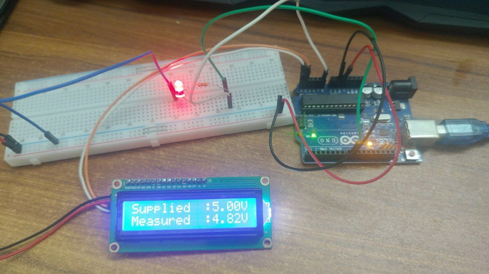
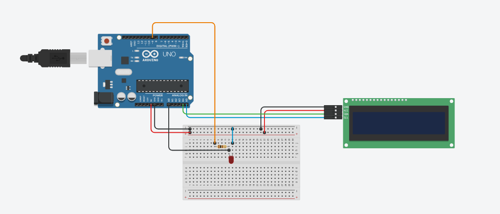
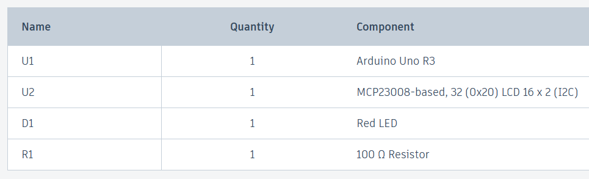

# Project-6: Digital Voltmeter using Arduino Uno & LCD Display
---

- ### Project Overview:
  [Visit Linkedin]()
  
- ### Project Code:
  [Click Here](Project_6_Voltmeter_with_LCD_Display_using_Arduino.ino)

- ### Project Purpose: 
To make an electric voltage measurement device aka **Voltmeter** using the implementation of ***Embedded Systems*** , which is heavily used in ***Electrical & Electronic Engineering***.

- ### Circuit Diagram:

- ### Component List:
